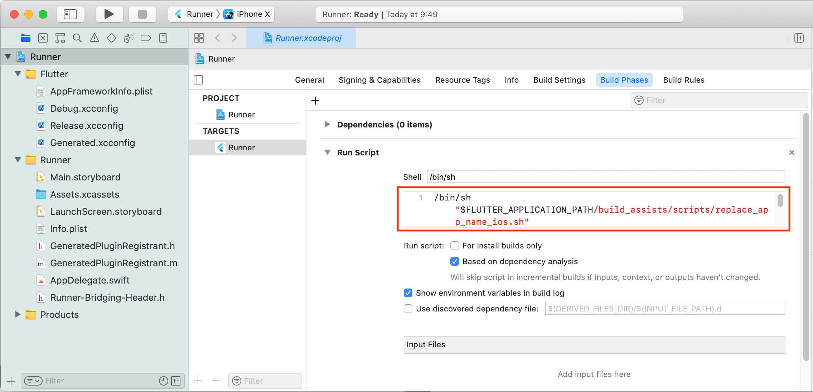

# [**Flutter #2 Advent Calendar 2020**](https://qiita.com/advent-calendar/2020/flutter-2)

### 12月01日 [Flutter 開発リポジトリにシークレット情報を保管させない。](https://cch-robo.github.io/memojudge_with_secret_consideration/index.html)

### はじめに

<table>
<tr>
  <td></td>
</tr>
</table>

このテキストは、 [Flutter Meetup Osaka #4 - 2020/11/27](https://flutter-jp.connpass.com/event/192795/) - LT発表 [フラッター開発でのシークレット情報取扱考察](https://www2.slideshare.net/cch-robo/ss-239527695) の検証編です。  
GitHub **リポジトリに秘匿情報を commit させない** で、ビルド前に **ビルド環境内で秘匿情報ファイルを復元** させて、  
`$ flutter run` コマンド実行時に、復元した秘匿情報ファイルを伴なわせてビルドさせる、  
Flutter開発における [リポジトリでのシークレット情報取扱考察](https://drive.google.com/file/d/1Btkbz85rWSvjfQIcWmNjvfU8YDJJ7IXR/view) の [考察検証リポジトリ](https://github.com/cch-robo/memojudge_with_secret_consideration) での検証方法と、  
「リポジトリに存在しない秘匿情報を復元するために、具体的に何をしているのか」についての解説です。  

- Flutter に関する技術的情報は、ほとんどないことや、  
シークレット情報の取り扱いには、秘匿化専用サービスやツールもありますが、  
ここでは簡易に内製化できる範囲にとどめます旨、御了承願います。

- *本当のシークレット情報をサンプルとして提供する訳には行きませんので、*  
*具体的には、 `$ flutter run` で実行した際のアプリ名 `memojudge` が、*  
*環境変数にパスワード内容等を設定すれば、*  
*リポジトリ内に存在しない別名称 `記憶力判定` などでビルドされるサンプルを提供します。*  

- *リポジトリ内のスクリプトは、macOS および Linux での `bash` や `zsh` での実行を想定しています。*  
*Windows 10環境での動作確認はできていません。*

<br/>
<br/>

---
### 秘匿情報を復元するために何をしているのか

検証リポジトリでは、**秘匿情報を復元する基本的なパターン**を行う２種類のスクリプトを実装しました。  
*スクリプトを使わない⇒リポジトリ内情報のみのビルド結果は、アプリ名が`memojudge`になります。*

- Aパターン (環境変数で 秘匿情報ファイルの復元データを取り扱う)  
  - 環境変数に秘匿情報の復元データ(Base64エンコード文字列)を設定することで、  
  リポジトリに存在しない秘匿情報(アプリ名`メモ判定`)をビルド結果に反映できるスクリプト。

- Bパターン (環境変数で 秘匿情報ファイルの復号化キーを取り扱う)  
  - 環境変数に秘匿情報の復号キー(OpenSSL暗号化秘匿情報ファイルのパスワード)を設定することで、  
  リポジトリに存在しない秘匿情報(アプリ名`記憶力判定`)をビルド結果に反映できるスクリプト。
  
<br/>

#### 秘匿情報を復元する基本的なパターンの全体構成概要

**秘匿情報を復元する基本的なパターン**を実現するためには、各種機能ごとの連携が必要です。  
スクリプトを機能させるには、入力元や出力先の規定や、ビルド中に処理をキックさせる設定も必要です。  
検証リポジトリでは、各機能ごとに連携できるよう、以下の全体構成を採りました。

- **秘匿情報復元作業ディレクトリ構成**  
入力元とエンコードやデコードの出力先およびスクリプトの配置を定めます。

- **秘匿情報復元処理スクリプト**  
入力された秘匿情報のエンコードやデコードおよびビルド中処理を役割ごとに分けます。

- **秘匿情報復元ビルド設定**  
ビルド中処理(復元秘匿情報ファイルの配置先コピー)をビルド中にキックさせる設定を追加します。

<br/>

#### 秘匿情報復元作業ディレクトリ構成

<table>
<tr>
  <td></td>
</tr>
</table>

|ディレクトリ名|公開 / 非公開|役割概要|
|----------|:----------:|----------|
|build_assists|公開|秘匿情報復元作業ディレクトリのルートディレクトリ|
|scripts|公開|スクリプト配置先ディレクトリ|
|work_private|非公開|入力用の秘匿情報ファイル配置先ディレクトリ|
|encode_private|非公開|秘匿情報ファイルの Base64エンコード出力配置先ディレクトリ|
|encode_public|公開|秘匿情報ファイルの OpenSSLエンコード(暗号化済)出力配置先ディレクトリ|
|decode_private|非公開|エンコードファイルのデコード(復号化済)出力配置先ディレクトリ|
|[.gitignore](https://github.com/cch-robo/memojudge_with_secret_consideration/blob/master/build_assists/.gitignore)|公開|上記作業ディレクトリの非公開指定設定ファイル|

<br/>

#### 秘匿情報復元処理スクリプト

|スクリプト名|機能種別|役割概要|
|----------|----------|----------|
|[encode_base64_work_to_private.sh](https://github.com/cch-robo/memojudge_with_secret_consideration/blob/master/build_assists/scripts/encode_base64_work_to_private.sh)|Base64エンコード|`work_private/`に配置された秘匿情報ファイルを Base64エンコードして `encode_private/`に出力します。|
|[encode_openssl_work_to_public.sh](https://github.com/cch-robo/memojudge_with_secret_consideration/blob/master/build_assists/scripts/encode_openssl_work_to_public.sh)|OpenSSLエンコード|`work_private/`に配置された秘匿情報ファイルを OpenSSLエンコード(暗号化)して `encode_public/`に出力します。|
|[decode_from_private.sh](https://github.com/cch-robo/memojudge_with_secret_consideration/blob/master/build_assists/scripts/decode_from_private.sh)|Base64デコード|`encode_public/`に配置された暗号化済秘匿情報ファイルを OpenSSLデコード(復号化)して `decode_private/`に出力します。|
|[decode_from_public.sh](https://github.com/cch-robo/memojudge_with_secret_consideration/blob/master/build_assists/scripts/decode_from_public.sh)|OpenSSLデコード|`encode_private/`に配置されたBase64エンコード済ファイルを Base64デコードして `decode_private/`に出力します。|
|アプリ名変更専用<br/> リソース置換用スクリプト名|
|[restore_app_name_secret_by_openssl.sh](https://github.com/cch-robo/memojudge_with_secret_consideration/blob/master/build_assists/scripts/restore_app_name_secret_by_openssl.sh)|一括処理|アプリ名変更用の補助スクリプト⇒OpenSSLを使った秘匿情報復元(暗号化済ファイルの復号化)から `$flutter run`までを一括して実行する。（環境変数 `PASSWD`に復号化キー(パスワード)を設定しておく必要があります ）|
|[replace_app_name_ios.sh](https://github.com/cch-robo/memojudge_with_secret_consideration/blob/master/build_assists/scripts/replace_app_name_ios.sh)|ビルド中処理|iOS用のアプリ名変更専用スクリプト⇒`decode_private/`に配置された復元済の秘匿情報ファイル(`decode_app_name_ios.txt`)を`ios/Runner/Info.plist`にコピーします。|
|[replace_app_name_android.sh](https://github.com/cch-robo/memojudge_with_secret_consideration/blob/master/build_assists/scripts/replace_app_name_android.sh)|ビルド中処理|Android用のアプリ名変更専用スクリプト⇒`decode_private/`に配置された復元済の秘匿情報ファイル(`decode_app_name_android.txt`)を`android/app/src/main/AndroidManifest.xml`にコピーします。|
|アプリ名変更専用<br/> リソース編集用スクリプト名|
|[restore_app_name_secret_by_base64.sh](https://github.com/cch-robo/memojudge_with_secret_consideration/blob/master/build_assists/scripts/restore_app_name_secret_by_base64.sh)|一括処理|アプリ名変更用の補助スクリプト⇒Base64を使った秘匿情報復元(変更するアプリ名の取得)から `$flutter run`までを一括して実行する。（環境変数 `APP_NAME`に Base64エンコードした変更アプリ名を設定しておく必要があります）|
|[rewrite_app_name_ios.sh](https://github.com/cch-robo/memojudge_with_secret_consideration/blob/master/build_assists/scripts/rewrite_app_name_ios.sh)|ビルド中処理|iOS用のアプリ名変更専用スクリプト⇒`decode_private/`に配置された変更アプリ名(`decode_app_name.txt`)の内容で、`ios/Runner/Info.plist`のアプリ名値を置換編集します。|
|[rewrite_app_name_android.sh](https://github.com/cch-robo/memojudge_with_secret_consideration/blob/master/build_assists/scripts/rewrite_app_name_android.sh)|ビルド中処理|Android用のアプリ名変更専用スクリプト⇒`decode_private/`に配置された変更アプリ名(`decode_app_name.txt`)の内容で、`android/app/src/main/AndroidManifest.xml`のアプリ名値を置換編集します。|

<br/>

#### 秘匿情報復元ビルド設定

|プラットフォーム|設定場所|設定方法|
|----------|----------|----------|
|iOS|[Xcodeプロジェクト](https://github.com/cch-robo/memojudge_with_secret_consideration/blob/master/ios/Runner.xcodeproj/project.pbxproj) >&nbsp;Runner&nbsp;>&nbsp;TARGETS > Build Phase > Run Script|Run Script設定に、sh からビルド中スクリプトをキックさせるコマンドを追加する。|
|Android|[app: build.gradle](https://github.com/cch-robo/memojudge_with_secret_consideration/blob/master/android/app/build.gradle)|`build.gradle`ファイルの末尾に `project.afterEvaluate{}`を追加して、ビルド中スクリプトをキックさせる関数を追加する。|

<table>
<theda><tr><th>iOSビルド処理のキック設定例 (Xcodeプロジェクト)</th></tr></theda>
<tr>
  <td></td>
</tr>
</table>

<table>
<theda><tr><th>Androidビルド処理のキック設定例 (app:build.gradle)</th></tr></theda>
<tr>
  <td><pre><code>
def replace_app_name() {
    exec {
        commandLine 'sh', '-c', '../../build_assists/scripts/replace_app_name_android.sh'
    }
}
project.afterEvaluate {
    replace_app_name()
}
  </code></pre></td>
</tr>
</table>

<br/>

#### 秘匿情報を復元する基本的なパターンの全体フロー

秘匿情報を復元する基本的なパターン実現するためには、  
入力秘匿情報ファイルのエンコード〜秘匿情報ファイル復元のデコード〜復元秘匿情報ファイルの配置…までのフローを行います。  
検証リポジトリでは、以下の全体フロー(秘匿情報の入力から復元ファイルの配置までのフロー)を採っています。

- A パターン (環境変数で 秘匿情報ファイルの復元データを取り扱う)  
  - 【事前準備】  
    - 秘匿情報ファイルをBase64でエンコードして、秘匿情報ファイルのBase64エンコード文字列を生成  
    [encode_base64_work_to_private.sh](https://github.com/cch-robo/memojudge_with_secret_consideration/blob/master/build_assists/scripts/encode_base64_work_to_private.sh) スクリプトで、
    `work_private/`に配置した秘匿情報ファイルをエンコードして、`encode_private/`に出力します。  
    *`work_private/`は、非公開ディレクトリのためリポジトリに存在しないので、エンコード前に手動生成しておきます。*  
    *生成したBase64エンコード文字列(Base64エンコードファイル)は、リポジトリ外で管理する必要があります。*

    - **ビルド中処理**(復元秘匿情報ファイルの配置先コピー)をビルド中にキックさせる設定を追加  
    *【ビルド中処理】の `復元秘匿情報ファイルをリソース先に配置(コピー)`を参照*

  - 【ビルド前】  
    - 指定名の環境変数に 秘匿情報ファイルのBase64エンコード文字列（秘匿ファイルの復元データ）を設定  
    *設定するエンコード文字列は、リポジトリ外で管理しておいたBase64エンコードファイルなどから取得します。*

    - 環境変数の 秘匿情報ファイルのBase64エンコード文字列をデコードして、秘匿情報ファイルを復元  
    [decode_from_private.sh](https://github.com/cch-robo/memojudge_with_secret_consideration/blob/master/build_assists/scripts/decode_from_private.sh) スクリプトで、
    環境変数に設定された秘匿情報ファイルのBase64エンコード文字列をデコードして、`decode_private/`に出力します。  

  - 【ビルド中処理】  
    - 復元秘匿情報ファイルをリソース先に配置(コピー)  
    `decode_private/`に配置された復元秘匿情報ファイルは、
    ファイルごとかつプラットフォームごとにコピー先が異なるため、**専用配置スクリプト**をプラットフォーム別で用意します。  
    またビルド中に任意処理をキックさせる設定(秘匿情報復元ビルド設定)もプラットフォームごとに異なるため、
    プラットフォームごとの**専用配置スクリプト**は、プラットフォームごとの**秘匿情報復元ビルド設定**に追加します。  
    　  
    ***ビルド中処理**をビルド中にキックさせる設定については、[秘匿情報復元ビルド設定](https://cch-robo.github.io/memojudge_with_secret_consideration/index.html#%E7%A7%98%E5%8C%BF%E6%83%85%E5%A0%B1%E5%BE%A9%E5%85%83%E3%83%93%E3%83%AB%E3%83%89%E8%A8%AD%E5%AE%9A) を参照ください。*  
    *検証リポジトリでは、アプリ名変更のための**専用配置スクリプト**が実装されています。*  
    *iOS用⇒[replace_app_name_ios.sh](https://github.com/cch-robo/memojudge_with_secret_consideration/blob/master/build_assists/scripts/replace_app_name_ios.sh)*  
    *Android用⇒[replace_app_name_android.sh](https://github.com/cch-robo/memojudge_with_secret_consideration/blob/master/build_assists/scripts/replace_app_name_android.sh)*  

  - 【備考】  
    - `decode_private`に復元秘匿情報ファイルが存在していれば、秘匿情報ファイルを復元する必要はありません。  
    検証リポジトリでは、ビルド結果に反映される秘匿情報を `decode_private`に配置された復元秘匿情報ファイルから取得しています。  

<br/>

- Bパターン (環境変数で 秘匿情報ファイルの復号化キーを取り扱う)  
  - 【事前準備】  
    - 秘匿情報ファイルをOpenSSLでエンコード(暗号化)して、秘匿情報ファイルのエンコード(暗号化)ファイルを生成  
    [encode_openssl_work_to_public.sh](https://github.com/cch-robo/memojudge_with_secret_consideration/blob/master/build_assists/scripts/encode_openssl_work_to_public.sh) スクリプトで、
    指定された暗号キー(パスワード文字列)を使い `work_private/`に配置した秘匿情報ファイルをエンコード(暗号化)して、`encode_public/`に出力します。  
    *`work_private/`は、非公開ディレクトリのためリポジトリに存在しないので、エンコード前に手動生成しておきます。*  
    *`encode_public/`に出力された、秘匿情報ファイルの OpenSSLエンコード(暗号化)ファイルは、暗号化済なのでリポジトリに `commit`できます。*  
    *暗号キー(パスワード文字列)は、リポジトリ外で管理する必要があります。*

    - **ビルド中処理**(復元秘匿情報ファイルの配置先コピー)をビルド中にキックさせる設定を追加  
    *【ビルド中処理】の `復元秘匿情報ファイルをリソース先に配置(コピー)`を参照*

  - 【ビルド前】  
    - 指定名の環境変数に 秘匿情報ファイルのOpenSSLエンコード(暗号化)に使用した、復号キー(パスワード文字列)を設定  
    *設定する復号キー⇒暗号キー(パスワード文字列)は、リポジトリ外の管理先などから取得します。*

    - 環境変数の 複合キー(パスワード文字列)を使い、暗号化された秘匿情報ファイルをOpenSSLデコード(復号化)して、秘匿情報ファイルを復元  
    [decode_from_public.sh](https://github.com/cch-robo/memojudge_with_secret_consideration/blob/master/build_assists/scripts/decode_from_public.sh) スクリプトで、
    環境変数に設定された複合キー(パスワード文字列)を使い暗号化された秘匿情報ファイルをOpenSSLデコード(復号化)して、`decode_private/`に出力します。

  - 【ビルド中処理】
    - 復元秘匿情報ファイルをリソース先に配置(コピー)  
    `decode_private/`に配置された復元秘匿情報ファイルは、
    ファイルごとかつプラットフォームごとにコピー先が異なるため、**専用配置スクリプト**をプラットフォーム別で用意します。  
    またビルド中に任意処理をキックさせる設定(秘匿情報復元ビルド設定)もプラットフォームごとに異なるため、
    プラットフォームごとの**専用配置スクリプト**は、プラットフォームごとの**秘匿情報復元ビルド設定**に追加します。  
    　  
    ***ビルド中処理**をビルド中にキックさせる設定については、[秘匿情報復元ビルド設定](https://cch-robo.github.io/memojudge_with_secret_consideration/index.html#%E7%A7%98%E5%8C%BF%E6%83%85%E5%A0%B1%E5%BE%A9%E5%85%83%E3%83%93%E3%83%AB%E3%83%89%E8%A8%AD%E5%AE%9A) を参照ください。*  
    *検証リポジトリでは、アプリ名変更のための**専用配置スクリプト**が実装されています。*  
    *iOS用⇒[replace_app_name_ios.sh](https://github.com/cch-robo/memojudge_with_secret_consideration/blob/master/build_assists/scripts/replace_app_name_ios.sh)*  
    *Android用⇒[replace_app_name_android.sh](https://github.com/cch-robo/memojudge_with_secret_consideration/blob/master/build_assists/scripts/replace_app_name_android.sh)*  

  - 【備考】  
    - `decode_private`に復元秘匿情報ファイルが存在していれば、秘匿情報ファイルを復元する必要はありません。  
    検証リポジトリでは、ビルド結果に反映される秘匿情報を `decode_private`に配置された復元秘匿情報ファイルから取得しています。  

<br/>

**秘匿情報を復元するために何をしているのか**を確認したので、  
実装したスクリプトが機能するか否かの検証に移ります。

<br/>
<br/>

---
### 検証準備と注意事項

- 考察検証リポジトリ（プロジェクト）のクローン  
考察検証リポジトリを以下のコマンドでクローンしてください。  
```$ git clone https://github.com/cch-robo/memojudge_with_secret_consideration.git```
  - *リポジトリ内のスクリプトは、macOS および Linux での `bash` や `zsh` での実行を想定しています。*  
  ***Windows 10環境での動作確認はできていません。***

  - 検証に使うスクリプト(下記)は、プロジェクト・ルートディレクトリからの実行を想定しています。  
  `decode_from_private.sh`、 `decode_from_public.sh`、  
  `encode_base64_work_to_private.sh`、 `encode_openssl_work_to_private.sh`、  
  `restore_app_name_secret_by_base64.sh`、 `restore_app_name_secret_by_openssl.sh`

- リポジトリに秘匿情報を保管させないコンセプトについては、  
[リポジトリでのシークレット情報取扱考察](https://drive.google.com/file/d/1Btkbz85rWSvjfQIcWmNjvfU8YDJJ7IXR/view) 全般を御確認ください。  
秘匿情報のエンコード/デコードおよび暗号化/復号化に利用する  
Base64や OpenSSL コマンドについては、P.12 〜 P.20 を御確認ください。

- 秘匿情報の暗号化/復号化には、OpenSSL 1.1.1 以上の共通鍵暗号方式を使います。  
`$ openssl version` で、お使いの環境が OpenSSL 1.1.1 以上になっているか確認してください。

- macOS 特有の注意事項
  - `homebrew` を使って最新の `OpenSSL` をインストールするかアップデートしてください。  
  macOS 標準の openssl コマンドの実態は LibreSSL になっています。  
  OpenSSLのインストールや環境設定の概要については、  
  [リポジトリでのシークレット情報取扱考察](https://drive.google.com/file/d/1Btkbz85rWSvjfQIcWmNjvfU8YDJJ7IXR/view) の P.20 を御確認ください。

  - Android Studio の `terminal`では、`OpenSSL`を優先化するパス設定を行ってください。  
  Android Studio の `Terminal`では、`LibreSSL`が優先化されるようです。  
  このため `~zshrc`や `~bashrc`で `OpenSSL`へのパス設定を行っていても、  
  この`Terminal`で、`$ export "PATH=$(brew --prefix openssl)/bin:$PATH"` を実行して、  
  インストールした OpenSSL へのパス `/usr/local/opt/openssl@1.1` を優先化してください。

  - `LibreSSL`が有効になっている場合、暗号化や復号化処理がマルウェアと判断される場合があります。
  


---
### リポジトリに保管されていない秘匿情報の復元検証

検証リポジトリでは、**秘匿情報を復元する基本的なパターン**を行う２種類のスクリプトを実装しています。

- Aパターン (環境変数で 秘匿情報ファイルの復元データを取り扱う)  
  - 環境変数に秘匿情報の復元データ(Base64エンコード文字列)を設定することで、  
  リポジトリに存在しない秘匿情報(アプリ名`メモ判定`)をビルド結果に反映できるスクリプト。

- Bパターン (環境変数で 秘匿情報ファイルの復号化キーを取り扱う)  
  - 環境変数に秘匿情報の復号キー(OpenSSL暗号化秘匿情報ファイルのパスワード)を設定することで、  
  リポジトリに存在しない秘匿情報(アプリ名`記憶力判定`)をビルド結果に反映できるスクリプト。
  
<br/>

**【検証概要】**  
- 秘匿情報を復元する基本的なパターンのスクリプトが機能することは、  
検証リポジトリをクローンしたプロジェクト内において、以下が行われることで確認できます。

1. 環境変数に何も設定していなければ、  
ビルド前に **秘匿情報ファイルの復元**を実行してもエラーにされ、  
`$flutter run`を実行させても、  
**通常のビルド**(アプリ名が`memojudge`)しか行われないことを確認する。

2. **環境変数**に、**秘匿情報の復元データ** または **復号キー**を設定(A/Bパターン)して、  
ビルド前に **秘匿情報ファイルの復元**を実行し、`$ flutter run`ビルドを行なわせれば、  
**リポジトリに存在しない秘匿情報を伴ったビルド**(アプリ名の変更)が行われることを確認する。  

<br/>
<br/>

#### 通常パターンの検証 (秘匿情報を復元しない)

- **【概要】**  
環境変数への設定を行わず、  
ビルド環境内で **秘匿情報ファイルを復元**を実行してもエラーになることを確認し、
そのまま `$ flutter run`ビルドを行わせます。  
*結果として、秘匿情報の復元が行われず通常のビルドが行われます。（アプリ名は、`memojudge`になる）*

<br/>

##### iOS 検証手順
```bash
# flutter run 実行前に、iOS シミュレーターを起動しておいてください。
$ ./build_assists/scripts/decode_from_private.sh APP_NAME_IOS decode_app_name_ios.txt
# 上記スクリプト実行は、指定環境変数設定がないのでエラーにされます。

$ flutter run
```

<table>
<thead><tr><th>ビルド後のホーム画面</th><th>アプリアイコン</th></tr></thead>
<tr>
  <td></td>
  <td></td>
</tr>
</table>

<br/>

##### Android 検証手順
```bash
# flutter run 実行前に、Android エミュレーターを起動しておいてください。
$ ./build_assists/scripts/decode_from_private.sh APP_NAME_ANDROID decode_app_name_android.txt
# 上記スクリプト実行は、指定環境変数設定がないのでエラーにされます。

$flutter run
```

<table>
<thead><tr><th>ビルド後のホーム画面</th><th>アプリアイコン</th></tr></thead>
<tr>
  <td></td>
  <td></td>
</tr>
</table>

<br/>
<br/>

#### Aパターンの検証 (環境変数に復元データをもたせる)

- **【概要】**  
**リポジトリに存在しない秘匿情報**を  
指定の環境変数に **秘匿情報ファイルの Base64デコード文字列**として設定し、  
ビルド環境内で **秘匿情報ファイルを復元**してから、`$ flutter run`ビルドさせるパターン。  
*アプリ名の設定項目を持つ `Info.plist` と `AndroidManifest.xml`ファイルが置換されます。*  
　  
*Base64デコード文字列を `build_assists/experiment`のファイルから取得していますが、*  
*これは実験のために用意していたもののため、本来のリポジトリには含まれていないリソースです。*

<br/>

##### iOS 検証手順
```bash
# flutter run 実行前に、iOS シミュレーターを起動しておいてください。
$ export APP_NAME_IOS=`cat ./build_assists/experiment/encode_app_name_ios.txt`
$ ./build_assists/scripts/decode_from_private.sh APP_NAME_IOS decode_app_name_ios.txt
$ flutter run
```

<table>
<thead><tr><th>ビルド後のホーム画面</th><th>アプリアイコン</th></tr></thead>
<tr>
  <td></td>
  <td></td>
</tr>
</table>

<br/>

##### Android 検証手順
```bash
# flutter run 実行前に、Android エミュレーターを起動しておいてください。
$ export APP_NAME_ANDROID=`cat ./build_assists/experiment/encode_app_name_android.txt`
$ ./build_assists/scripts/decode_from_private.sh APP_NAME_ANDROID decode_app_name_android.txt
$ flutter run
```

<table>
<thead><tr><th>ビルド後のホーム画面</th><th>アプリアイコン</th></tr></thead>
<tr>
  <td></td>
  <td></td>
</tr>
</table>

<br/>
<br/>

#### Bパターンの検証 (環境変数に復号キーをもたせる)

- **【概要】**  
環境変数に **秘匿情報ファイルの 復号キー(パスワード)** を設定し、  
ビルド環境内で **リポジトリに直接存在しないが、暗号化済の秘匿情報**から  
**秘匿情報ファイルを復元**して、`$ flutter run`ビルドさせるパターン。  
*アプリ名の設定項目を持つ `Info.plist` と `AndroidManifest.xml`ファイルが置換されます。*  
　  
*OpenSSL暗号化データを `build_assists/encode_public`のファイルから取得しています。*  
*これは暗号化済の秘匿情報ファイルのため、本来のリポジトリに元から含めて良いリソースです。*

<br/>

##### iOS 検証手順
```bash
# flutter run 実行前に、iOS シミュレーターを起動しておいてください。
$ export PASSWD=hogefuga
$ ./build_assists/scripts/decode_from_public.sh encode_app_name_ios.txt decode_app_name_ios.txt PASSWD
$ flutter run
```

<br/>

*【補足】秘匿情報の復元と`$ flutter run`までを一括して行うスクリプトも用意しています。*
```bash
# flutter run 実行前に、iOS シミュレーターか Android エミュレータを起動しておいてください。
$ export PASSWD=hogefuga
$ ./build_assists/scripts/restore_app_name_secret_by_openssl.sh
```

<table>
<thead><tr><th>ビルド後のホーム画面</th><th>アプリアイコン</th></tr></thead>
<tr>
  <td></td>
  <td></td>
</tr>
</table>

<br/>

##### Android 検証手順
```bash
# flutter run 実行前に、Android エミュレーターを起動しておいてください。
$ export PASSWD=hogefuga
$ ./build_assists/scripts/decode_from_public.sh encode_app_name_android.txt decode_app_name_android.txt PASSWD
$ flutter run
```

<br/>

*【補足】秘匿情報の復元と`$ flutter run`までを一括して行うスクリプトも用意しています。*
```bash
# flutter run 実行前に、iOS シミュレーターか Android エミュレータを起動しておいてください。
$ export PASSWD=hogefuga
$ ./build_assists/scripts/restore_app_name_secret_by_openssl.sh
```

<table>
<thead><tr><th>ビルド後のホーム画面</th><th>アプリアイコン</th></tr></thead>
<tr>
  <td></td>
  <td></td>
</tr>
</table>

<br/>
<br/>

---
### むすび

[フラッター開発でのシークレット情報取扱考察](https://www2.slideshare.net/cch-robo/ss-239527695) と  
考察検証説明の [Flutter 開発リポジトリにシークレット情報を保管させない。](https://cch-robo.github.io/memojudge_with_secret_consideration/index.html)   
および [考察検証リポジトリ](https://github.com/cch-robo/memojudge_with_secret_consideration) の内容は、簡易に内製化できる範囲にとどまっています。  
このため商用 CI/CD サービスを使ってシークレット情報管理をされている方から見れば、初歩レベルと思います。

もしもこの**リポジトリに秘匿情報を保管させない考察**と **考察検証リポジトリ**が、お役に立つことがあれば幸いです。
