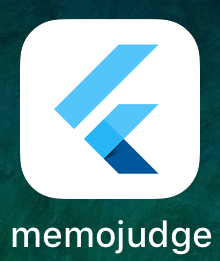
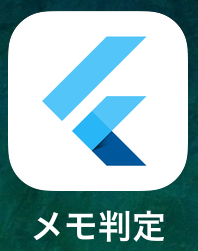
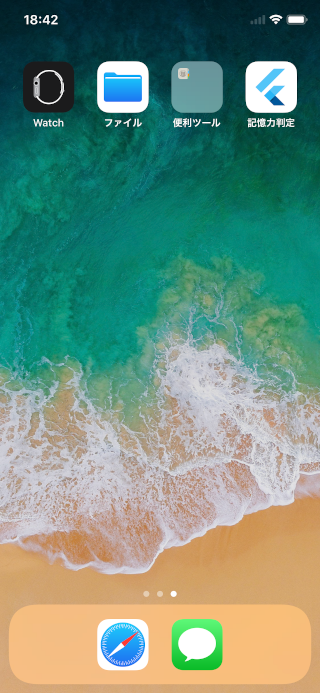

# [**Flutter #2 Advent Calendar 2020**](https://qiita.com/advent-calendar/2020/flutter-2)

### 12月01日 [Flutter 開発リポジトリにシークレット情報を保管させない。](https://cch-robo.github.io/memojudge_with_secret_consideration/index.html)

### はじめに

このテキストは、 [Flutter Meetup Osaka #4 - 2020/11/27](https://flutter-jp.connpass.com/event/192795/) - LT発表 [フラッター開発でのシークレット情報取扱考察](https://www2.slideshare.net/cch-robo/ss-239527695) の検証編です。  
GitHub **リポジトリに秘匿情報を commit させない** で、ビルド前に **ビルド環境内で秘匿情報ファイルを復元** させて、  
`$ flutter run` コマンド実行時に、復元した秘匿情報ファイルを伴なわせてビルドさせる、  
Flutter開発における [リポジトリでのシークレット情報取扱考察](https://www2.slideshare.net/cch-robo/ss-239527695) の [考察検証リポジトリ](https://github.com/cch-robo/memojudge_with_secret_consideration) について説明します。  

- Flutter に関する技術的情報は、ほとんどないことや、  
シークレット情報の取り扱いには、秘匿化専用サービスやツールもありますが、  
ここでは簡易に内製化できる範囲にとどめます旨、御了承願います。

- *本当のシークレット情報をサンプルとして提供する訳には行きませんので、*  
*具体的には、 `$ flutter run` で実行した際のアプリ名 `memojudge` が、*  
*環境変数にパスワード内容等を設定すれば、*  
*リポジトリ内に存在しない別名称 `記憶力判定` などでビルドされるサンプルを提供します。*  

- *リポジトリ内のスクリプトは、macOS および Linux での `bash` や `zsh` での実行を想定しています。*  
*Windows 10環境での動作確認はできていません。*

- 考察検証リポジトリとシークレット情報取扱の資料について。  
考察検証リポジトリのコードやスクリプトおよびコンテンツは [BSD-3-Clause License ライセンス](https://github.com/cch-robo/memojudge_with_secret_consideration/blob/master/LICENSE) に則り、  
自由に御利用ください。  
  - [考察検証リポジトリ](https://github.com/cch-robo/memojudge_with_secret_consideration)  
  [https://github.com/cch-robo/memojudge_with_secret_consideration](https://github.com/cch-robo/memojudge_with_secret_consideration)

  - [リポジトリでのシークレット情報取扱考察](https://www2.slideshare.net/cch-robo/ss-239527695) テキスト  
  [https://www2.slideshare.net/cch-robo/ss-239527695](https://www2.slideshare.net/cch-robo/ss-239527695)

  - [リポジトリでのシークレット情報取扱考察検証](https://cch-robo.github.io/memojudge_with_secret_consideration/) テキスト  
  [https://cch-robo.github.io/memojudge_with_secret_consideration/](https://cch-robo.github.io/memojudge_with_secret_consideration/)


- サンプルアプリは、 [DevFest 2020 セッション](https://tokyo.gdgjapan.org/devfest2020/schedule/2/205) で発表したミニゲームをベースにしています。  
[リポジトリ](https://github.com/cch-robo/DevFest-Kyoto-2020) の GitHubページには、 [講座テキスト](https://cch-robo.github.io/DevFest-Kyoto-2020/index.html) もありますので、よろしければ こちらも御参照ください。  
　  
講座テキスト内容は、ステップごとにアプリのコードを追加改修していきながら、  
画面の部分更新やアニメーションやタイマーの使い方の基本を学ぶ形式になっています。  
ライブラリも使いますが、学んだ基本知識を応用して、ボタン操作のイベントやタイマーを使った自動処理で、  
アニメーションを伴ったリアクションを返す画面を作る考え方を伝え、最終的に簡単なゲームアプリを作ります。  
　  
このリポジトリのコードやスクリプトおよびコンテンツも [BSD-3-Clause License ライセンス](https://github.com/cch-robo/memojudge_with_secret_consideration/blob/master/LICENSE) に則り、  
自由に御利用ください。  

<table><thead><tr><th>

</th></tr></thead></table>

  - [Flutter初心者向け講座（ミニゲームを作ろう）](https://tokyo.gdgjapan.org/devfest2020/schedule/2/205)  
  [https://tokyo.gdgjapan.org/devfest2020/schedule/2/205](https://tokyo.gdgjapan.org/devfest2020/schedule/2/205)

  - [講座リポジトリ](https://github.com/cch-robo/DevFest-Kyoto-2020)  
  [https://github.com/cch-robo/DevFest-Kyoto-2020](https://github.com/cch-robo/DevFest-Kyoto-2020)

  - [講座テキスト](https://cch-robo.github.io/DevFest-Kyoto-2020/index.html)  
  [https://cch-robo.github.io/DevFest-Kyoto-2020/index.html](https://cch-robo.github.io/DevFest-Kyoto-2020/index.html)

---
### 検証準備と注意事項

- 考察検証リポジトリ（プロジェクト）のクローン  
考察検証リポジトリを以下のコマンドでクローンしてください。  
```$ git clone https://github.com/cch-robo/memojudge_with_secret_consideration.git```
  - *リポジトリ内のスクリプトは、macOS および Linux での `bash` や `zsh` での実行を想定しています。*  
  ***Windows 10環境での動作確認はできていません。***

  - 検証に使うスクリプト(下記)は、プロジェクト・ルートディレクトリからの実行を想定しています。  
  `decode_from_private.sh`、 `decode_from_public.sh`、  
  `encode_base64_work_to_private.sh`、 `encode_openssl_work_to_private.sh`、  
  `restore_app_name_secret_by_base64.sh`、 `restore_app_name_secret_by_openssl.sh`

- リポジトリに秘匿情報を保管させないコンセプトについては、  
[リポジトリでのシークレット情報取扱考察](https://drive.google.com/file/d/1Btkbz85rWSvjfQIcWmNjvfU8YDJJ7IXR/view) 全般を御確認ください。  
秘匿情報のエンコード/デコードおよび暗号化/復号化に利用する  
Base64や OpenSSL コマンドについては、P.12 〜 P.20 を御確認ください。

- 秘匿情報の暗号化/復号化には、OpenSSL 1.1.1 以上の共通鍵暗号方式を使います。  
`$ openssl version` で、お使いの環境が OpenSSL 1.1.1 以上になっているか確認してください。

- macOS 特有の注意事項
  - `homebrew` を使って最新の `OpenSSL` をインストールするかアップデートしてください。  
  macOS 標準の openssl コマンドの実態は LibreSSL になっています。  
  OpenSSLのインストールや環境設定の概要については、  
  [リポジトリでのシークレット情報取扱考察](https://drive.google.com/file/d/1Btkbz85rWSvjfQIcWmNjvfU8YDJJ7IXR/view) の P.20 を御確認ください。

  - Android Studio の `terminal`では、`OpenSSL`を優先化するパス設定を行ってください。  
  Android Studio の `Terminal`では、`LibreSSL`が優先化されるようです。  
  このため `~zshrc`や `~bashrc`で `OpenSSL`へのパス設定を行っていても、  
  そこで、`$ export "PATH=$(brew --prefix openssl)/bin:$PATH"` を実行して、  
  インストールした OpenSSL へのパス `/usr/local/opt/openssl@1.1` を優先化してください。

  - `LibreSSL`が有効になっている場合、暗号化や復号化処理がマルウェアと判断される場合があります。
  


---
### リポジトリに保管されていない秘匿情報の復元検証

**【概要】**  
リポジトリクローンしたプロジェクト内において、以下が行われることを確認します。

1. 環境変数に何も設定していなければ、  
ビルド前に **秘匿情報ファイルの復元**を実行してもエラーにされ、  
`$flutter run`を実行させても、  
**通常のビルド**(アプリ名が`memojudge`)しか行われないことを確認する。

2. **環境変数**に、**秘匿情報の復元データ** または **復号キー**を設定して、  
ビルド前に **秘匿情報ファイルの復元**を実行し、`$ flutter run`ビルドを行なわせれば、  
**リポジトリに存在しない秘匿情報を伴ったビルド**(アプリ名の変更)が行われることを検証します。  

<br/>
<br/>

#### 通常パターンの検証 (秘匿情報を復元しない)

- **【概要】**  
環境変数への設定を行わず、  
ビルド環境内で **秘匿情報ファイルを復元**を実行してもエラーになることを確認し、
そのまま `$ flutter run`ビルドを行わせます。  
*結果として、秘匿情報の復元が行われず通常のビルドが行われます。（アプリ名は、`memojudge`になる）*

<br/>

##### iOS 検証手順
```bash
# flutter run 実行前に、iOS シミュレーターを起動しておいてください。
$ ./build_assists/scripts/decode_from_private.sh APP_NAME_IOS decode_app_name_ios.txt
# 上記スクリプト実行は、指定環境変数設定がないのでエラーにされます。

$ flutter run
```

<table>
<thead><tr><th>ビルド後のホーム画面</th><th>アプリアイコン</th></tr></thead>
<tr>
  <td></td>
  <td></td>
</tr>
</table>

<br/>

##### Android 検証手順
```bash
# flutter run 実行前に、Android エミュレーターを起動しておいてください。
$ ./build_assists/scripts/decode_from_private.sh APP_NAME_ANDROID decode_app_name_android.txt
# 上記スクリプト実行は、指定環境変数設定がないのでエラーにされます。

$flutter run
```

<table>
<thead><tr><th>ビルド後のホーム画面</th><th>アプリアイコン</th></tr></thead>
<tr>
  <td></td>
  <td></td>
</tr>
</table>

<br/>
<br/>

#### Aパターンの検証 (環境変数に復元データをもたせる)

- **【概要】**  
**リポジトリに存在しない秘匿情報**を  
指定の環境変数に **秘匿情報ファイルの Base64デコード文字列**として設定し、  
ビルド環境内で **秘匿情報ファイルを復元**してから、`$ flutter run`ビルドさせるパターン。  
*アプリ名の設定項目を持つ `Info.plist` と `AndroidManifest.xml`ファイルが置換されます。*  
　  
*Base64デコード文字列を `build_assists/experiment`のファイルから取得していますが、*  
*これは実験のために用意していたもののため、本来のリポジトリには含まれていないリソースです。*

<br/>

##### iOS 検証手順
```bash
# flutter run 実行前に、iOS シミュレーターを起動しておいてください。
$ export APP_NAME_IOS=`cat ./build_assists/experiment/encode_app_name_ios.txt`
$ ./build_assists/scripts/decode_from_private.sh APP_NAME_IOS decode_app_name_ios.txt
$ flutter run
```

<table>
<thead><tr><th>ビルド後のホーム画面</th><th>アプリアイコン</th></tr></thead>
<tr>
  <td></td>
  <td></td>
</tr>
</table>

<br/>

##### Android 検証手順
```bash
# flutter run 実行前に、Android エミュレーターを起動しておいてください。
$ export APP_NAME_ANDROID=`cat ./build_assists/experiment/encode_app_name_android.txt`
$ ./build_assists/scripts/decode_from_private.sh APP_NAME_ANDROID decode_app_name_android.txt
$ flutter run
```

<table>
<thead><tr><th>ビルド後のホーム画面</th><th>アプリアイコン</th></tr></thead>
<tr>
  <td></td>
  <td></td>
</tr>
</table>

<br/>
<br/>

#### Bパターンの検証 (環境変数に復号キーをもたせる)

- **【概要】**  
環境変数に **秘匿情報ファイルの 復号キー(パスワード)** を設定し、  
ビルド環境内で **リポジトリに直接存在しないが、暗号化済の秘匿情報**から  
**秘匿情報ファイルを復元**して、`$ flutter run`ビルドさせるパターン。  
*アプリ名の設定項目を持つ `Info.plist` と `AndroidManifest.xml`ファイルが置換されます。*  
　  
*OpenSSL暗号化データを `build_assists/encode_public`のファイルから取得しています。*  
*これは暗号化済の秘匿情報ファイルのため、本来のリポジトリに元から含めて良いリソースです。*

<br/>

##### iOS 検証手順
```bash
# flutter run 実行前に、iOS シミュレーターを起動しておいてください。
$ export PASSWD=hogefuga
$ ./build_assists/scripts/decode_from_public.sh encode_app_name_ios.txt decode_app_name_ios.txt PASSWD
$ flutter run
```

<table>
<thead><tr><th>ビルド後のホーム画面</th><th>アプリアイコン</th></tr></thead>
<tr>
  <td></td>
  <td></td>
</tr>
</table>

<br/>

##### Android 検証手順
```bash
# flutter run 実行前に、Android エミュレーターを起動しておいてください。
$ export PASSWD=hogefuga
$ ./build_assists/scripts/decode_from_public.sh encode_app_name_android.txt decode_app_name_android.txt PASSWD
$ flutter run
```

<table>
<thead><tr><th>ビルド後のホーム画面</th><th>アプリアイコン</th></tr></thead>
<tr>
  <td></td>
  <td></td>
</tr>
</table>

<br/>
<br/>

---
### 秘匿情報を復元するために何をしているのか

---
### むすび
